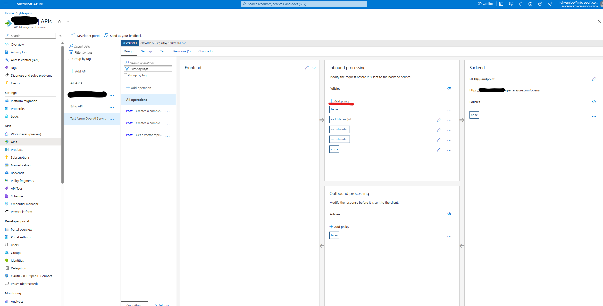
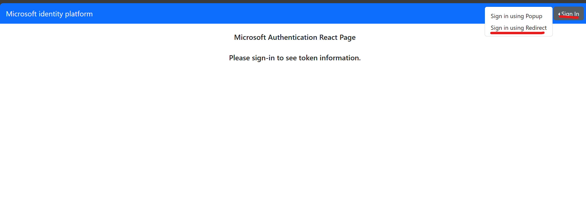

apim-oauth-spa
============

Single page Demo Application using react.\
Connects to a tenant via Microsoft Entra ID using msal.js\
Generates JWT token and calls Azure APIM endpoint, which will be proxy to Azure OpenAI API\
Msal library is available in multiple programming languages, such as C#, Javascript, Python\
https://learn.microsoft.com/en-us/entra/msal/

Before Starting
------------

1. Follow these steps to create a MS Entra ID App to generate Oauth flow\
https://learn.microsoft.com/en-us/graph/toolkit/get-started/add-aad-app-registration#add-new-application-registration-in-microsoft-entra-id
    * if you are running this locally, make sure to add a plaform under Authenication page.
        * single-page application
        * add http://localhost:3000 and http://localhost:3000/redirect to the redirect URIs
    * these are optional steps
        * expose an API and add custom scope to furthur configure JWT

2. Follow these stepts to set up Azure API Mangement instance with Azure OpenAI\
https://learn.microsoft.com/en-us/semantic-kernel/deploy/use-ai-apis-with-api-management#setup-azure-api-management-instance-with-azure-openai-api

3. add these to the policy under apim\
    [](apim-policy.png)

```xml
<inbound>
    //other policy
    <base />
    <validate-jwt header-name="Authorization" failed-validation-httpcode="401" failed-validation-error-message="Unauthorized. Access token is missing or invalid.">
        <openid-config url="https://login.microsoftonline.com/{aad-tenant}/v2.0/.well-known/openid-configuration" />
        <audiences>
            <audience>{audience-value - (ex: guid)}</audience>
        </audiences>
        <issuers>
            <issuer>{issuer-value - (ex: https://login.microsoftonline.com/{tenant id}/v2.0)}</issuer>
        </issuers>
    </validate-jwt>
    <set-header name="Authorization" exists-action="delete" />
    <set-header name="api-key" exists-action="append">
        <value>{{azure-openai-key}}</value>
    </set-header>
    <cors allow-credentials="false">
        <allowed-origins>
            <origin>*</origin>
        </allowed-origins>
        <allowed-methods preflight-result-max-age="300">
            <method>GET</method>
            <method>POST</method>
            <method>OPTIONS</method>
            <method>PUT</method>
            <method>PATCH</method>
        </allowed-methods>
        <allowed-headers>
            <header>*</header>
        </allowed-headers>
        <expose-headers>
            <header>*</header>
        </expose-headers>
    </cors>
    // other policy
</inbound>
```

4. install Node.js\
https://nodejs.org/en/download/

5. Install all Packages
```
npm install
```

6. Populate the .env file
```
REACT_APP_OAUTH_CLIENT_ID=<APP ID FROM ENTRA ID APP>
REACT_APP_OAUTH_TENANT_ID=<TENANT ID OF THE ENTRA ID APP>
REACT_APP_OAUTH_SCOPE=<SCOPE OF THE TOKEN COMMA SEPERATED> //ex."User.Read,api://1234-5678-910112/apim.access"
REACT_APP_REDIRECT_URI="http://localhost:3000"
REACT_APP_APIM_BASE_ENDPOINT=<APIM ENDPOINT>
REACT_APP_AOAI_DEPLOYMENT_ID=<AZURE OPENAI DEPLOYMENT NAME>
REACT_APP_AOAI_API_VERSION=<AZURE OPENAI API VERSION>
```

Running the App
------------

* run the app
```
npm start
```

On Startup
------------
* Go to http://localhost:3000

* use the "Sign in" button on the top right
    * perferrably use the "Sign in using Redirect"\
[](spa-login.png)
* sign in using the tenant account.
* once logged in use the "Get Acceess Token" to generate the access token
    * keep in mind that token will expire when reaching the "Expires" time (typically an hour)
* use the Chatbox to call the AOAI endpoint thru APIM layer

------------
Cloned and modified from sample code
https://learn.microsoft.com/en-us/samples/azure-samples/ms-identity-ciam-javascript-tutorial/ms-identity-ciam-javascript-tutorial-1-sign-in-react/
