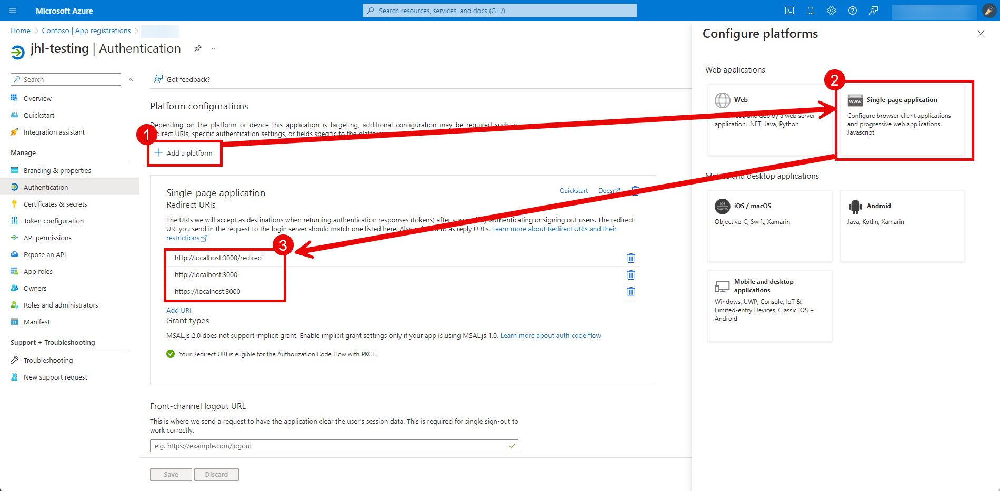
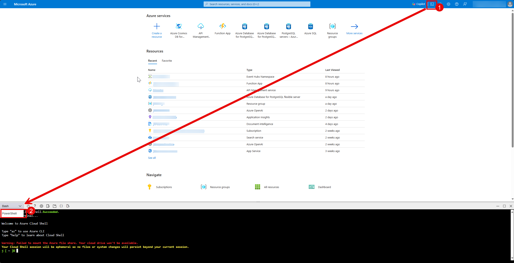
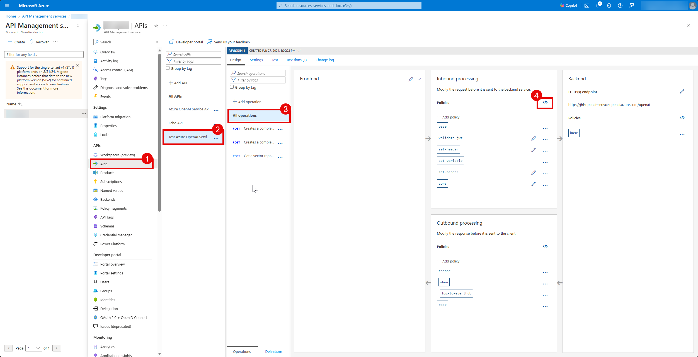
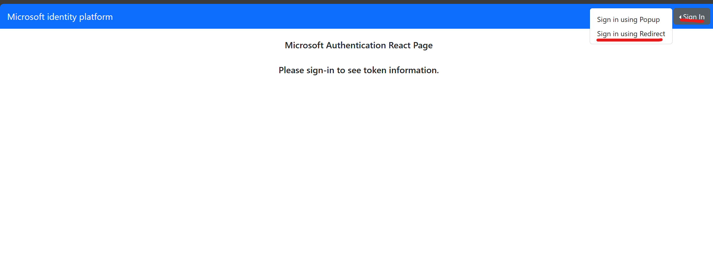

apim-oauth-spa
============

Single page Demo Application using react.\
Connects to a tenant via Microsoft Entra ID using msal.js\
Generates JWT token and calls Azure APIM endpoint, which will be proxy to Azure OpenAI API\
Msal library is available in multiple programming languages, such as C#, Javascript, Python\
https://learn.microsoft.com/en-us/entra/msal/

Before Starting
------------

### 1. MicroSoft EntraID Application
* Follow steps [here](https://learn.microsoft.com/en-us/graph/toolkit/get-started/add-aad-app-registration#add-new-application-registration-in-microsoft-entra-id) to create a MS Entra ID App to generate Oauth flow
    * if you are running this locally, make sure to add a plaform under Authenication page.
        * single-page application
        * add http://localhost:3000 and http://localhost:3000/redirect to the redirect URIs

        * [](spa-adding.png)
    * [optional] you can add apim scope to the jwt scope using web api scoping
        * expose an API and add custom scope to furthur configure JWT [here](https://learn.microsoft.com/en-us/entra/identity-platform/quickstart-configure-app-expose-web-apis#add-a-scope)
        * you can use this custom scope to add to JWT for allowing APIM access.

### 2. Azure OpenAI Service
* create and deploy Azure OpenAI services to be used with the API managemnet service

### 3. Azure API Management
* create the Azure API Management service, details of the steps [here](https://learn.microsoft.com/en-us/azure/api-management/get-started-create-service-instance)
    * download the Azure OpenAI reference and import it to the API Management Services
    * [how to import Azure OpenAI to API Management](https://learn.microsoft.com/en-us/semantic-kernel/deploy/use-ai-apis-with-api-management#setup-azure-api-management-instance-with-azure-openai-api)

### 4. Azure EventHub
* create an Azure EventHub to allow logging of usage for API Management
* create a event hub with the name correctly
* use Azure cli to create an event-logger on apim services.
    * [](eventhub-cli-create.png)
    * ```cli
        # API Management service-specific details
        $apimServiceName = "YOUR_APIM_SERVICE_NAME"
        $resourceGroupName = "YOUR_RESOURCE_GROUP_NAME"
        $apimLoggerID = "YOUR_LOGGER_NAME_FOR_APIM"
        $eventHubName = "YOUR_EVENT_HUB_NAME"
        $eventHubConnectionString = "YOUR_EVENT_HUB_CONNECTION_STRING"
        $loggerDescription = "Event hub logger with connection string"

        # Create logger
        $context = New-AzApiManagementContext -ResourceGroupName $resourceGroupName -ServiceName $apimServiceName
        New-AzApiManagementLogger -Context $context -LoggerId $apimLoggerID -Name $eventHubName -ConnectionString $eventHubConnectionString -Description $loggerDescription
        ```
    * you can view the existing eventhub loggers by running this command 
        ```cli
            $apimContext = New-AzApiManagementContext -ResourceGroupName $resourceGroupName -ServiceName $apimServiceName
            Get-AzApiManagementLogger -Context $apimContext
        ```
### 5. [Optional] Azure Function App
* create Azure function app with trigger on eventhub to view and process usage logs

### 6. Update APIM Policy
* [](edit-policy.png)
* the policy should look similar to [this](./readme-img/policy-example.xml) - readme-img/policy-example.xml

### 7. Setting Up Local React Application
* install Node.js [here](https://nodejs.org/en/download)
* change the working directory ```cd react-app```
* install required packages ```npm install```
* fill out the env variable inside .env
    * ```
        REACT_APP_OAUTH_CLIENT_ID=<APP ID FROM ENTRA ID APP>
        REACT_APP_OAUTH_TENANT_ID=<TENANT ID OF THE ENTRA ID APP>
        REACT_APP_OAUTH_SCOPE=<SCOPE OF THE TOKEN COMMA SEPERATED> //ex."User.Read,api://1234-5678-910112/apim.access"
        REACT_APP_REDIRECT_URI="http://localhost:3000"
        REACT_APP_APIM_BASE_ENDPOINT=<APIM ENDPOINT>
        REACT_APP_AOAI_DEPLOYMENT_ID=<AZURE OPENAI DEPLOYMENT NAME>
        REACT_APP_AOAI_API_VERSION=<AZURE OPENAI API VERSION>
        ```

Starting
------------
* run the react application ```npm start```
* Go to http://localhost:3000
* use the "Sign in" button on the top right
    * perferrably use the "Sign in using Redirect"\
[](spa-login.png)
* sign in using the tenant account.
* once logged in use the "Get Acceess Token" to generate the access token
    * keep in mind that token will expire when reaching the "Expires" time (typically an hour)
* use the Chatbox to call the AOAI endpoint thru APIM layer

------------
##### React application is modified version of microsoft sample 
* https://learn.microsoft.com/en-us/samples/azure-samples/ms-identity-ciam-javascript-tutorial/ms-identity-ciam-javascript-tutorial-1-sign-in-react/
##### This is not intended to be used inside a production environment, local testing only.
